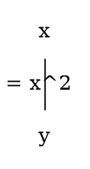

## Equation

Example:
```math
2x + 3y = 5
```

Here, 
    
    2, 3 & 5 are the constants and x & y are the variables.

- Here constants values are fixed and variables values are not fixed.

Other Examples:
```math
x^2 - 1 = 0
```
```math
2x -4 = 0
```
## Function

Example:
```math
y = 2x + 1
```
| x   | 1   | 3   |
| --- | --- | --- |
| y   | 2   | 5   |

Every function is a equation but every equation is not a function.

Input ➡️ x

Output ➡️ y

Funcation : If we put a value in a function then it will give a value.

Variable :-
1. Independent Variable
2. Dependent Variable

Here, x is the independent variable and y is the dependent variable.

**Question 1 :** Is it a function which is given below?
```math 
y^2 = x
```
**Answer :** No, it is not a function because if we put a value in y then it will give two values of x.

Explanation : 
```math
\begin{align}
y^2 &= x \\
y &= \pm \sqrt{x}
\end{align}
```
So, we can say that it is not a function. Because if we put a value in y then it will give two values of x. One is positive and another is negative.

**Question 2 :** Is it a function which is given below?
```math
x^2 + y^2 = 1
```
**Answer :** No, it is not a function because if we put a value in x then it will give two values of y.

Explanation : 
```math
\begin{align}
x^2 + y^2 &= 1 \\
y^2 &= 1 - x^2 \\
y &= \pm \sqrt{1 - x^2}
\end{align}
```
So, we can say that it is not a function. Because if we put a value in x then it will give two values of y. One is positive and another is negative.

**Question 3 :** Is it a function which is given below?
```math
y^3 = x
```
**Answer :** Yes, it is a function because if we put a value in y then it will give only one value of x.

Explanation : 
```math
\begin{align}
y^3 &= x \\
y^3_{\frac{1}{3}} &= x_{\frac{1}{3}} \\
y &= x_{\frac{1}{3}}
\end{align}
```
So, we can say that it is a function. Because if we put a value in y then it will give only one value of x.There didnot found any positive or negative value.

- Note : Only square root is not a function but cube root is a function.

## The Vertical Line Test

If we draw a vertical line in a graph and it cuts the graph in one point then it is a function. But if it cuts the graph in two points then it is not a function.

Example : 
