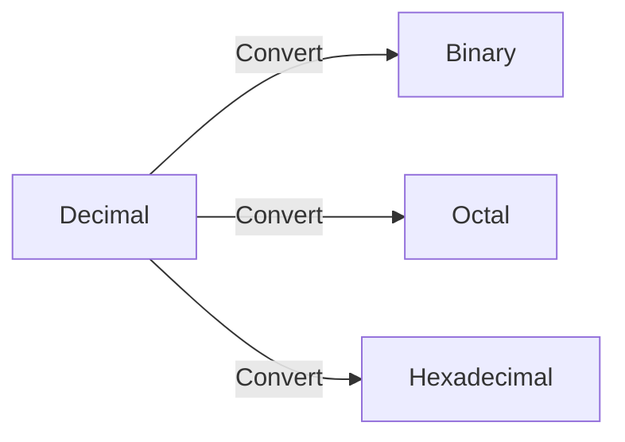
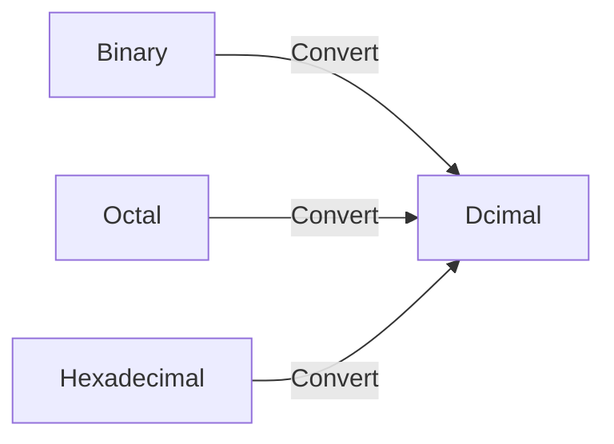
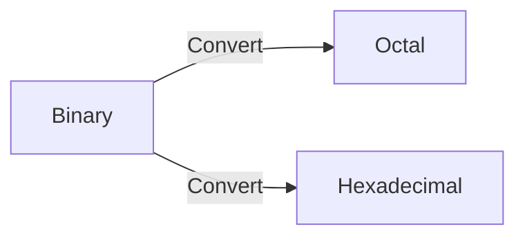

# Number System

    - Binary (0, 1)
    - Octal (0, 1, 2, 3, 4, 5, 6, 7)
    - Decimal (0, 1, 2, 3, 4, 5, 6, 7, 8, 9)
    - Hexadecimal (0, 1, 2, 3, 4, 5, 6, 7, 8, 9, A, B, C, D, E, F)
        - Here, 
                
                A = 10;
                B = 11;
                C = 12;
                D = 13;
                E = 14;
                F = 15.



**Question 1**: Convert 46.6875 to binary & octal & hexadecimal.
**Solution:**
- Decimal to Binary

```math
\begin{align}
\frac{46}{2} &= 23 \text{ Remainder } 0 \text{ LSB (Least Significant Bit) } \\
\frac{23}{2} &= 11 \text{ Remainder } 1 \\
\frac{11}{2} &= 5 \text{ Remainder } 1 \\
\frac{5}{2} &= 2 \text{ Remainder } 1 \\
\frac{2}{2} &= 1 \text{ Remainder } 0 \\
\frac{1}{2} & = 0 \text{ Remainder } 1 \text{ MSB (Most Significant Bit) } \\
\end{align}
```

```math
\begin{align}
0.6875 \times 2 &= 1.375 \text{ Integer Part } 1 \\
0.375 \times 2 &= 0.75 \text{ Integer Part } 0 \\
0.75 \times 2 &= 1.5 \text{ Integer Part } 1 \\
0.5 \times 2 &= 1.0 \text{ Integer Part } 1 \\
\end{align}
```

So, we can say that 46.6875 = 101110.1011

- Decimal to Octal

```math
\begin{align}
\frac{46}{8} &= 5 \text{ Remainder } 6 \text{ LSB (Least Significant Bit) } \\
\frac{5}{8} &= 0 \text{ Remainder } 5 \text{ MSB (Most Significant Bit) } \\
\end{align}
```

```math
\begin{align}
0.6875 \times 8 &= 5.5 \text{ Integer Part } 5 \\
0.5 \times 8 &= 4.0 \text{ Integer Part } 4 \\
\end{align}
```

So, we can say that 46.6875 = 56.54

- Decimal to Hexadecimal

```math
\begin{align}
\frac{46}{16} &= 2 \text{ Remainder } 14 \text{ LSB (Least Significant Bit) } \\
\frac{2}{16} &= 0 \text{ Remainder } 2 \text{ MSB (Most Significant Bit) } \\
\end{align}
```

```math
\begin{align}
0.6875 \times 16 &= 11.0 \text{ Integer Part } B \\
\end{align}
```

So, we can say that 46.6875 = 2E.B



**Question 2**: Convert 1101.11(Binary) to Decimal.
**Solution:**
- Binary to Decimal

```math
\begin{align}
&= 1 \times 2^3 + 1 \times 2^2 + 0 \times 2^1 + 1 \times 2^0 + 1 \times 2^{-1} + 1 \times 2^{-2} 
&= 8 + 4 + 0 + 1 + 0.5 + 0.25 \\
&= 13.75
\end{align}
```
**Question 3**: Convert 1001010.001(Binary) to Decimal.
**Solution:**
- Binary to Decimal

```math
\begin{align}
&= 1 \times 2^6 + 0 \times 2^5 + 0 \times 2^4 + 1 \times 2^3 + 0 \times 2^2 + 1 \times 2^1 + 0 \times 2^0 + 0 \times 2^{-1} + 0 \times 2^{-2} + 1 \times 2^{-3} \\
&= 64 + 0 + 0 + 8 + 0 + 2 + 0 + 0 + 0 + 0.125 \\
&= 74.125
\end{align}
```
**Question 4**: Convert 675.15(Octal) to Decimal.
**Solution:**
- Octal to Decimal

```math
\begin{align}
&= 6 \times 8^2 + 7 \times 8^1 + 5 \times 8^0 + 1 \times 8^{-1} + 5 \times 8^{-2} \\
&= 384 + 56 + 5 + 0.125 + 0.0390625 \\
&= 445.1640625
\end{align}
```
**Question 5**: Convert 67A.C1(Hexadecimal) to Decimal.
**Solution:**
- Hexadecimal to Decimal

```math
\begin{align}
&= 6 \times 16^2 + 7 \times 16^1 + 10 \times 16^0 + 12 \times 16^{-1} + 1 \times 16^{-2} \\
&= 1536 + 112 + 10 + 0.75 + 0.00390625 \\
&= 1658.75390625
\end{align}
```


**Question 6**: Convert 1001110.11101(Binary) to Octal & Hexadecimal.
**Solution:**
- Binary to Octal

Base of Binary is 2 and Base of Octal is 8.

```math
2^3 = 8
```

| 8 | | |
|---|--|--|
| Octal | | |
| 4 | 2 | 1 |

Technique: Grouping

Binary: 1001110.11101

We can write it as 001 001 110.111 010

Group 1 = 001

Group 2 = 001

Group 3 = 110

Group 4 = 111

Group 5 = 010

Apply the table to each group.

|Group 1 | | | |
|--------|-|-|-|
| 0 | 0 | 1 | |
| 4 | 2 | 1 | |

So, 0 * 4 + 0 * 2 + 1 * 1 = 1

|Group 2 | | | |
|--------|-|-|-|
| 0 | 0 | 1 | |
| 4 | 2 | 1 | |

So, 0*4 + 0*2 + 1*1 = 1
 
|Group 3 | | | |
|--------|-|-|-|
| 1 | 1 | 0 | |
| 4 | 2 | 1 | |

So, 1*4 + 1*2 + 0*1 = 6

|Group 4 | | | |
|--------|-|-|-|
| 1 | 1 | 1 | |
| 4 | 2 | 1 | |

So, 1*4 + 1*2 + 1*1 = 7

|Group 5 | | | |
|--------|-|-|-|
| 0 | 1 | 0 | |
| 4 | 2 | 1 | |

So, 0*4 + 1*2 + 0*1 = 2

So, we can say that 1001110.11101(Binary) = 126.72(Octal)
