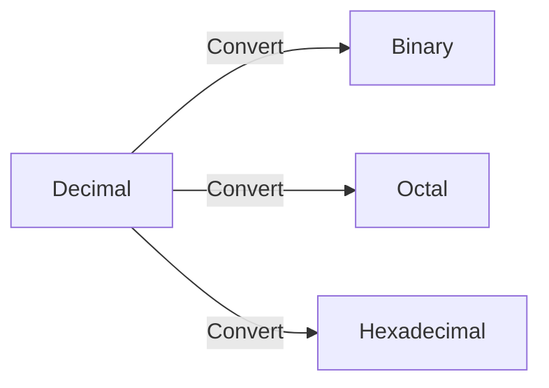

# Number System

    - Binary (0, 1)
    - Octal (0, 1, 2, 3, 4, 5, 6, 7)
    - Decimal (0, 1, 2, 3, 4, 5, 6, 7, 8, 9)
    - Hexadecimal (0, 1, 2, 3, 4, 5, 6, 7, 8, 9, A, B, C, D, E, F)
        - Here, 
                
                A = 10;
                B = 11;
                C = 12;
                D = 13;
                E = 14;
                F = 15.



**Question 1**: Convert 46.6875 to binary & octal & hexadecimal.
**Solution:**

```math
\begin{align}
\frac{46}{2} &= 23 \text{ Remainder } 0 \text{ LSB (Least Significant Bit) } \\
\frac{23}{2} &= 11 \text{ Remainder } 1 \\
\frac{11}{2} &= 5 \text{ Remainder } 1 \\
\frac{5}{2} &= 2 \text{ Remainder } 1 \\
\frac{2}{2} &= 1 \text{ Remainder } 0 \\
\frac{1}{2} & = 0 \text{ Remainder } 1 \text{ MSB (Most Significant Bit) } \\
\end{align}
```

```math
\begin{align}
0.6875 \times 2 &= 1.375 \text{ Integer Part } 1 \\
0.375 \times 2 &= 0.75 \text{ Integer Part } 0 \\
0.75 \times 2 &= 1.5 \text{ Integer Part } 1 \\
0.5 \times 2 &= 1.0 \text{ Integer Part } 1 \\
\end{align}
```

So, we can say that 46.6875 = 101110.1011

